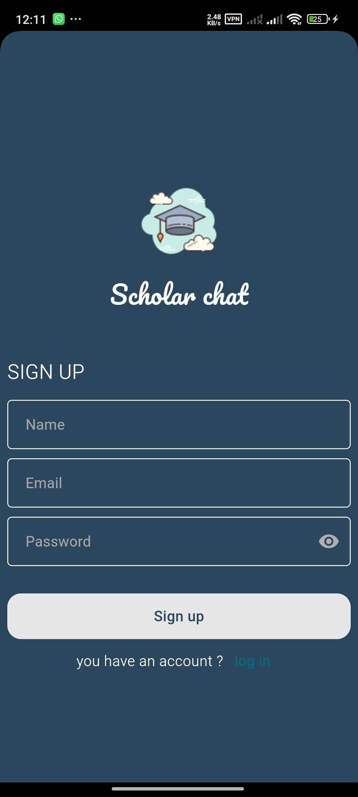
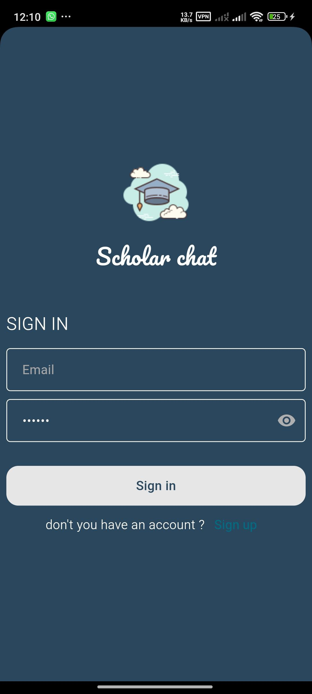
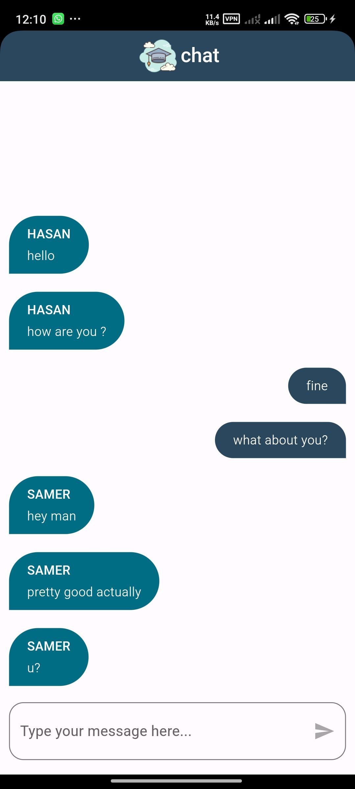

# Scholar Chat App

**Scholar Chat App is a simple Flutter-based real-time chat application that uses Firebase for authentication and Cloud Firestore for real-time messages. It demonstrates a production-friendly chat UI with message send/receive, per-message sender metadata (name/email), basic input validation, and support for Arabic/English directionality.**

---


### 🖼️ App Preview

|                         Singup                         |                         Login                         |                         chat                          |
| :---------------------------------------------------: | :---------------------------------------------------: | :----------------------------------------------------: |
|  |  |  |

---

### ✨ Key Highlights

*   ⚡ **Real-Time Messaging** using Cloud Firestore streams
*   🔐 **Firebase Authentication** for secure login and signup
*   🧑‍💬 **Sender Metadata** (name & email) displayed for every message
*   🌐 **Bilingual Support** — automatically detects Arabic vs English and adjusts text direction dynamically
*   💬 **Custom Chat UI** with clipped chat bubbles and alignment per sender
*   ✅ **Input Validation** prevents empty messages and ensures reliable message flow
*   🧩 **Modular Architecture** — clear separation between models, widgets, and screens for readability and 

---

### 🧩 Technologies & Tools

*   **Flutter (Dart)** — UI & Logic
*   **Firebase Suite:**
    *   `firebase_core`
    *   `firebase_auth`
    *   `cloud_firestore`
*   **UI Helpers:**
    *   `modal_progress_hud_nsn` — for loading overlays

---

### 🧠 What This Project Demonstrates

*   Integrating **Flutter with Firebase Authentication** and **Cloud Firestore**
*   Working with **real-time Firestore streams** and model mapping
*   Managing **state and controllers** in a reactive UI
*   Handling **bidirectional text rendering** for multilingual content
*   Creating **custom chat UI components** with Flutter’s widget system
*   Applying **clean code structure** and defensive data parsing

---

### ⚙️ Setup & Run

1. Clone the repository:

   ```bash
   git clone https://github.com/omaras101/weather_app.git
   ```
2. Install dependencies:

   ```bash
   flutter pub get
   ```
3. Add your weather API key in the configuration file.
4. Run the app:

   ```bash
   flutter run
   ```

---

### 💡 Future Improvements

Potential next steps and UX features you might add:

*   🎨 Unique color mapping per sender (stored locally via `shared_preferences`)
*   🧑‍🎨 Auto-generated avatars using sender initials
*   ❤️ Message reactions, edit/delete, and read receipts
*   ✍️ Typing indicators & online presence tracking
*   🔔 Push notifications via Firebase Cloud Messaging
*   🧾 Chat pagination & infinite scrolling
*   🧠 Smarter mixed-language text rendering with `RichText` and `Bidi` handling
*   🧪 Comprehensive unit & widget tests
*   ⚙️ CI/CD integration for automated testing and deployment
